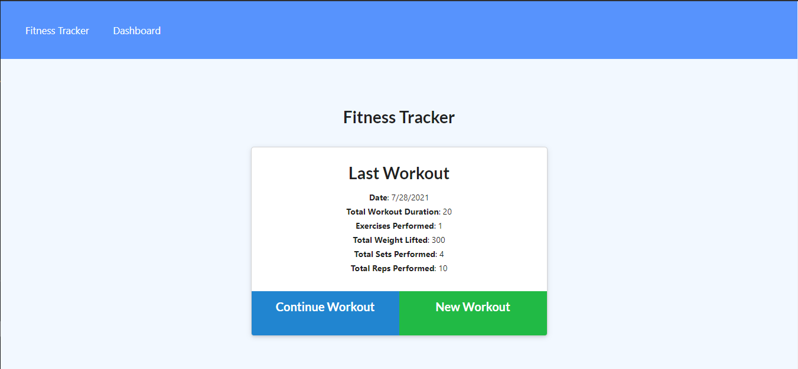
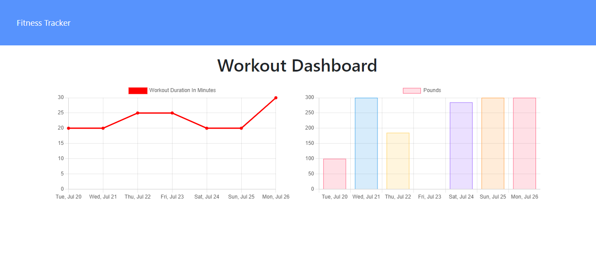
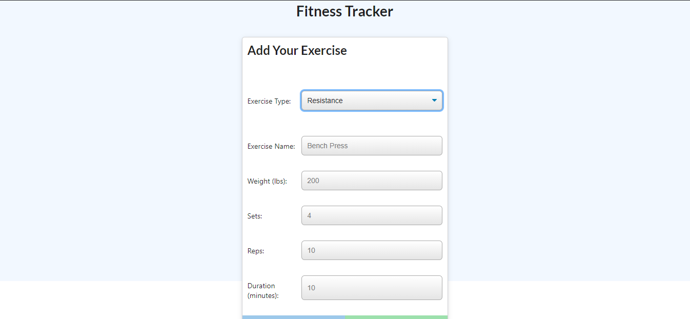

# Fitness App

For this project I setup a server backend and schema through MongoDB for a Fitness Tracking Application. The app is hosted on heroku and can be found here --> https://fitnessforyou.herokuapp.com/

The objectives to complete this Project include the following:

After navigating to the webpage...
* The user is directed to a landing page where they can preview their previous workout
* The user can then click to add workouts or view their dashboard
* The dashboard page provides 2 charts to display previous workouts
* Adding a workout requires filling out a form with the necessary details

# Fitness Tracker

# Dashboard

# Adding a Workout

View Live Webpage!
https://fitnessforyou.herokuapp.com/